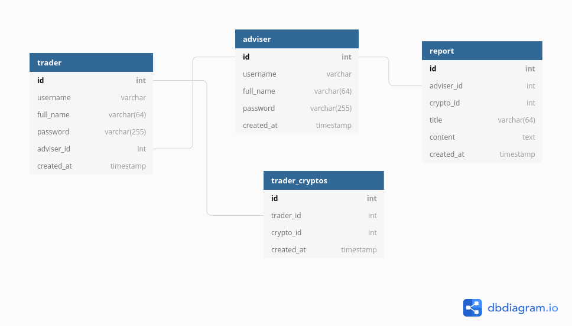

# BILAN PROJET PC3R - WEB

- [BILAN PROJET PC3R - WEB](#bilan-projet-pc3r---web)
  - [Sujet](#sujet)
  - [APIs REST](#apis-rest)
    - [Synchronisation depuis l'API](#synchronisation-depuis-lapi)
  - [Features](#features)
  - [Use-Case](#use-case)
  - [Base de données](#base-de-données)
  - [Serveur](#serveur)
    - [Technologies](#technologies)
  - [Client](#client)
    - [Description des query](#description-des-query)
  - [Schema global](#schema-global)
    - [fonctionalite requis](#fonctionalite-requis)

## Sujet
**Crypto-Adviser**\
L'application web (monopage) a pour thème la monnaie virtuelle, elle est nommée
« Crypto-Adviser», elle a pour objectif de mettre en évidences l'évolution des différentes données concernant les cryptos-monnaies en temps réel, les *tradeurs* ont aussi la possibilité de consulter des articles et pronostiques couramment mises à jour de la part d'*experts* certifiés. 

## APIs REST 
- https://coinmarketcap.com/api/documentation/v1/
- https://www.coinlore.com/cryptocurrency-data-api 

L'API ***Coinmarketcap*** nous fournit plusieurs informations détaillés à propos des cryptos-monnaies, on a opté pour l'abonnement "Basic" qui est limité mais gratuit et permet d'avoir toutes les donées nécessaires tel que le prix, le volume, le rang, la marketcap, etc.
Le nombre de requetes par jour est limite a 333, les données (le prix pour l'exemple) sont mis à jours instantanément.

Le seconde API ***Coinlore*** est totalement gratuite, elle a été choisi pour compléter le role de la dérnière (dans le cas où l'utilisateur dépasse le nombre de requettes autorisées), elle fournit moins informations que *coinmarketcap*.

Notre application collectera les données nécessaires pour simuler les statistiques.

### Synchronisation depuis l'API
1) AJAX

## Features

- En tant que ***visitor*** sans inscription.
- Inscription au choix pour les nouveaux utilisateurs.
- Authentification en tant que ***trader***.
- Authentification en tant que ***adviser*** (conseiller).
- Ecran principal sur lequel on peut trouver le cours des cryptos
monnaies et diverses données en temps réel.
- Recherche par chaine de caractère. 
- Filtrage et classement par rapport a differents critères (e.g prix).
- Ajout, modification et supperssion d'un commentaire sur un poste par le trader ou de l'adviser.
- Ajout, modification et supperssion d'une monnaie virtuelle dans le profile du trader ou de l'adviser.
- Publication des articles ou/et avis d'expèrtise par un ***adviser***.

## Use-Case
1. Alice est visiteur, elle se rend sur le site de l'application web, elle consulte l'écran principal qui lui indique l'ensemble des données statistiques en temps réels des cryptos-monnaies, ensuite elle filtre par la capitalisation (Cap. Marché) et demande l'affichage des 10 premièrs résultats.

2. Max est sur l'écran principal, étant déja un *trader* il s’authentifie, il cherche `BTC` dans le barre de recherche, l'application lui affiche les informations sur le `Bitcoin`, il décide de l'ajouter à son profile.

3. Inès est *adviser*, elle se connecte à l'application,
elle choisi de publier un pronostique sur `ETH`, l'application lui affiche un formulaire composé d'un champs de texte et quelques options (e.g : ajouter des graphes), enfin, elle répond aux commentaires des ***traders***.

<!-- un liste des données qui seront stockées dans la base de données du serveur, leur composition,
éventuellement des schémas de tables. -->
## Base de données

## Serveur

### Technologies
- [x] Ressource
- [ ] Component Diagram + fct de chaque component
- [ ] serveur : Java - Servlet
- [ ] client : ReactJS

## Client
- une description du client: plan du site (probablement une application monopage), contenu des
  ´ecrans ; bien identifier `a quels endroits apparaissent les appels aux diff´erents composants du serveur

### Description des query
- HTTP - JSON
- 

## Schema global
- 
  

### fonctionalite requis
- [x] Venus
- [x] (profils, commentaires, notes, messages, publications)
- [x] generer par les utilisateurs

