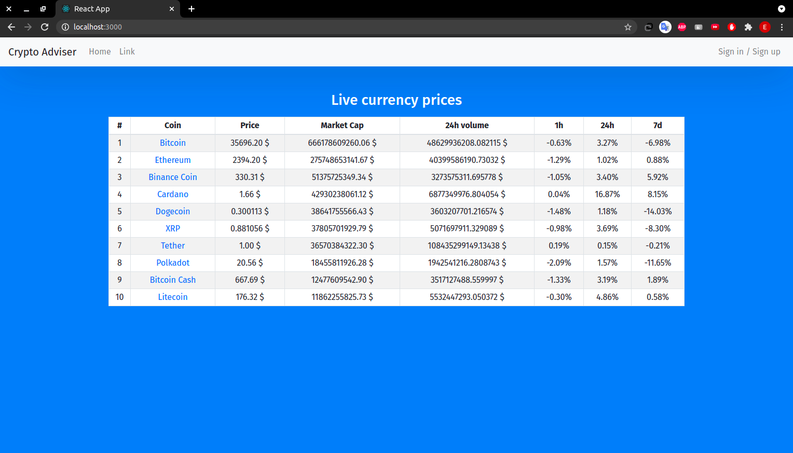
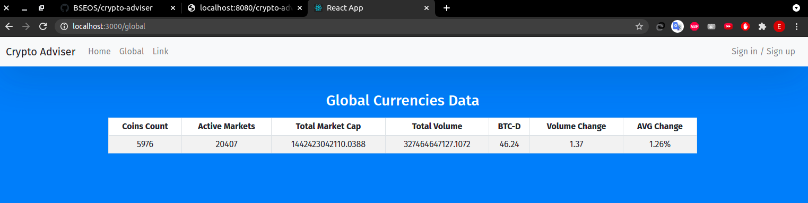
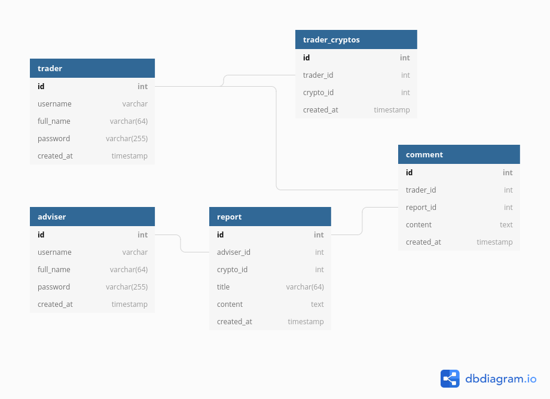

# BILAN PROJET PC3R - WEB

- [BILAN PROJET PC3R - WEB](#bilan-projet-pc3r---web)
  - [Sujet](#sujet)
  - [APIs REST](#apis-rest)
    - [Synchronisation depuis l'API](#synchronisation-depuis-lapi)
  - [Features](#features)
  - [Use-Case](#use-case)
  - [Base de données](#base-de-données)
  - [Serveur](#serveur)
    - [Les ressources](#les-ressources)
      - [ User ](#span-stylecolorblue-user-span)
      - [ Report ](#span-stylecolorblue-report-span)
      - [ Comment ](#span-stylecolorblue-comment-span)
  - [Client](#client)
  - [Description des requêtes](#description-des-requêtes)
    - [Utilisateur](#utilisateur)
    - [Report](#report)
    - [Comment](#comment)
    - [General](#general)
  - [Schema global](#schema-global)
    - [Fonctionalités requis](#fonctionalités-requis)

\

## Sujet
**Crypto-Adviser**\
L'application web (monopage) a pour thème la monnaie virtuelle, elle est nommée
« Crypto-Adviser», elle a pour objectif de mettre en évidences l'évolution des différentes données concernant les cryptos-monnaies en temps réel, les *tradeurs* ont aussi la possibilité de consulter des articles et pronostiques couramment mises à jour de la part d'*experts* certifiés. 

## APIs REST 
- https://coinmarketcap.com/api/documentation/v1/
- https://www.coinlore.com/cryptocurrency-data-api 

L'API ***Coinmarketcap*** nous fournit plusieurs informations détaillés à propos des cryptos-monnaies, on a opté pour l'abonnement "Basic" qui est limité mais gratuit et permet d'avoir toutes les donées nécessaires tel que le prix, le volume, le rang, la marketcap, etc.
Le nombre de requetes par jour est limite a 333, les données (le prix pour l'exemple) sont mis à jours instantanément.

Le seconde API ***Coinlore*** est totalement gratuite, elle a été choisi pour compléter le role de la dérnière (dans le cas où l'utilisateur dépasse le nombre de requettes autorisées), elle fournit moins informations que *coinmarketcap*.

Notre application collectera les données nécessaires pour simuler les statistiques.

<!-- un paragraphe expliquant comment les données sont mises à jour et quand l’API externe est appelée, -->
### Synchronisation depuis l'API
 
> Les données utilisés pour généré des statistiques tel que le cours des crypto-monnaies sont mis à jours 
Les données statistiques sont meises à jour sur l'écran principal automatiquement, donc l'api est appelée régulierement (exemple toutes les 20 secondes).

> pour chaque filtrage ou recherche l'application va lancer une requete afin d'extraire les information visés (exemple toutes les monnaies ayant un prix entrx et y).

## Features

- En tant que ***visitor*** sans inscription.
- Inscription au choix pour les nouveaux utilisateurs.
- Authentification en tant que ***trader***.
- Authentification en tant que ***adviser*** (conseiller).
- Ecran principal sur lequel on peut trouver le cours des cryptos
monnaies et diverses données en temps réel.
- Recherche par chaine de caractère. 
- Filtrage et classement par rapport a differents critères (e.g prix).
- Ajout, modification et supperssion d'un commentaire sur un poste par le trader ou de l'adviser.
- Ajout, modification et supperssion d'une monnaie virtuelle dans le profile du trader ou de l'adviser.
- Publication des articles ou/et avis d'expèrtise par un ***adviser***.

## Use-Case
1. Alice est visiteur, elle se rend sur le site de l'application web, elle consulte l'écran principal qui lui indique l'ensemble des données statistiques en temps réels des cryptos-monnaies, ensuite elle filtre par la capitalisation (Cap. Marché) et demande l'affichage des 10 premièrs résultats.

2. Max est sur l'écran principal, étant déja un *trader* il s’authentifie, il cherche `BTC` dans le barre de recherche, l'application lui affiche les informations sur le `Bitcoin`, il décide de l'ajouter à son profile.

3. Inès est *adviser*, elle se connecte à l'application,
elle choisi de publier un pronostique sur `ETH`, l'application lui affiche un formulaire composé d'un champs de texte et quelques options (e.g : ajouter des graphes), enfin, elle répond aux commentaires des ***traders***.

<!-- un liste des données qui seront stockées dans la base de données du serveur, leur composition,
éventuellement des schémas de tables. -->
## Base de données

<!-- une description du serveur: choix de l’approche (Service ou Ressources), composition (liste des
services ou des ressources) et fonctionnalités associées à chacun des composants. -->
## Serveur
- [x] Ressource
- [x] Java - Servlet

### Les ressources
####  User 
>Pour permettre l’authentification des Trader et des Adviser dans le but de crée et/ou commenté du contenu, ainsi que la géstion du tableau de bord (liste des cryptos suivis).

####  Report 
>Permet aux conseillers de publier leur pronostiques pour une certaine crypo-monnaie.

####  Comment 
>Permet aux Traders de publier leur avis ou demander conseil concernant le rapport publié.

<!-- une description du client: plan du site (probablement une application monopage), contenu des
écrans ; bien identifier à quels endroits apparaissent les appels aux différents composants du serveur, -->
## Client
- [x] ReactJS

1. le ***visitor*** arrive sur un **écran d’accueil** constituer d’une partie sur
laquelle il peut cliquer afin que l'écran d’authentification (ou d’inscription) apparaît s’il le souhaite, un outil de recherche et de filtrage, les données statistiques en temps réelles avec une pagination (10 par 10).

2. L’utilisateur enregistré (***trader*** ou ***adviser***) peut choisir de
s’authentifier sur **l'écran de connexion**, une fois
connecté, l'écran (modal) disparait, il reste donc sur le principal,

3. ***Ecran de crypto-monnai*** En cliquant sur l’une des monnaies virtuelles un écran spécifique s'affiche afin de consulter et éditer les rapports et les commentaire de ce dernier.
   
4. Sur l'écran ***Tableau de bord*** on peut consulter et étditer la liste des crypto-monnaies suivis, exceptionnelement pour les adviser ils peuvent y retrouver une archives de tous leurs postes.

5. Le ***Adviser*** connecté sur l'écran d'une crypto-monnaie peut appuyer sur le boutton publication d'un ***report***, ainsi l'application lui ouvre un écran contenant un formulaire de texte afin de rediger le rapport.

<!-- une description des requêtes (requête HTTP) et réponses (contenu JSON de la
réponse HTTP) entre le client et le serveur, -->
## Description des requêtes
- HTTP - JSON

### Utilisateur
- **Get login** récupère les informations d'un utilisateur *[Utilisateurs connecté]*

- **POST login mdp** -> authentifie un utilisateur / récupère son identifiant
- **PUT full_name login mdp** -> inscription d'un nouvel utilisateur /
récupère son identifiant
- **DELETE login** -> supprime un utilisateur *[Utilisateur connecté]*

- **PUT id_crytpo login** -> ajout d'une crypto-monnaie de sa liste /
récupère son identifiant
- **DELETE id_crytpo login** -> supprime d'une crypto-monnaie de sa liste *[Utilisateur connecté]*

- **GET login** -> déconnexion de l'utilisateur *[Utilisateurs connecté]* 

### Report

- **PUT id_crypto login text** -> Ajout d’un nouveau
rapport lié à une crypto-monnaie / récupère son identifiant *[Utilisateur connecté et éditeur]*

- **POST id_report login text** -> Modifie un
rapport déja éxistant lié à une crypto-monnaie / récupère son identifiant *[Utilisateur connecté et éditeur]*

- **DELETE id_report login** -> supprime un rapport *[Utilisateurs connecté et éditeur]*

### Comment

- **PUT id_report login text** -> Ajout d’un nouveau
commentaire au rapport / récupère son identifiant *[Utilisateur connecté et éditeur]*

- **POST id_comment login text** -> Modifie un
commentaire correspendant à un rapport / récupère son identifiant *[Utilisateur connecté et éditeur]*
id_comment login** -> supprime un commentaire *[Utilisateurs connecté et éditeur]*

### General
- **GET id_crypto** -> si il est *[visitor]* alors il récupère tous les les statistiques si *[Utilisateurs connecté]*  récupère aussi les rapports et les commentaires
correspondant. 

- **POST text** -> récupérer les crypto-monnaies qui correspondent à la chaine de caractère.

- **POST filters** -> récupérer les crypto-monnaies qui satisfont les critètres choisies.

## Schema global
- 
  

### Fonctionalités requis
- [x] generer par les utilisateurs
- [x] (profils, commentaires, notes, messages, publications)

